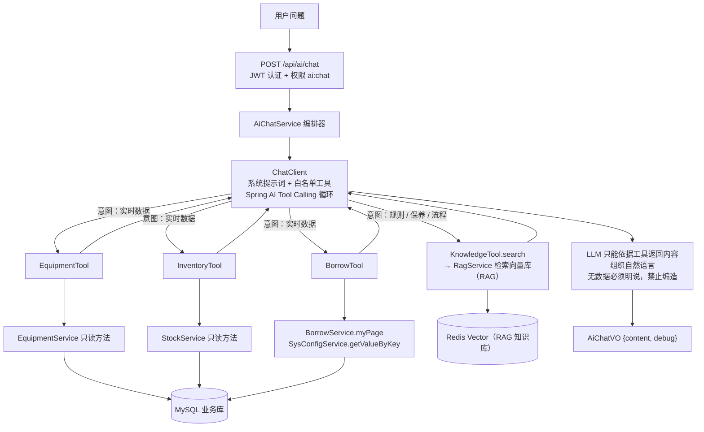

# AI 客服最终升级：AI + RAG + 业务数据 + Tool Calling 架构设计

> 日期：2026-08-14
> 分支：develop（worktree `.worktrees/phase-01-scaffold`）
> 状态：设计定稿；M1-M4 已全部实施（每模块独立验证、独立提交），2026-08-14 发布 v3.2.0。

## 1. 背景与现状

系统已具备两套能力：

- AI 智能客服（v3.0.0）：`POST /api/ai/chat`，Spring AI 1.1.8 + OpenAI 兼容协议（DeepSeek 等）。
- RAG 知识库（v3.1.0）：内置 11 篇器材知识文档，向量检索 + 严格约束 Prompt 生成回答。

当前缺陷：对话入口对所有问题一律先走 RAG，检索无命中就返回固定文案「知识库中暂无相关信息。」，因此「现在篮球还有多少个？」这类需要查询真实业务数据的问题无法回答，也没有任何受控的业务数据通道。

## 2. 目标与硬约束

目标：让 AI 客服能区分并正确处理两类问题：

- 知识类（怎么保养 / 怎么借 / 规则流程）→ RAG 知识库；
- 业务数据类（当前库存 / 我的借阅记录）→ 查询真实业务数据库，由 LLM 组织成自然语言。

硬约束（逐条落实，见第 6 节安全边界表）：

1. AI 不能直接执行 SQL；
2. AI 不能修改数据库；
3. 所有业务操作必须经过 Service 层；
4. 所有 Tool 必须进行权限校验；
5. 查询库存必须返回真实数据库数据；
6. 不允许 AI 虚构库存；
7. 不允许 AI 虚构借用记录。

## 3. 总体架构



## 4. 数据流

```text
用户问题
  ↓ POST /api/ai/chat（JWT 认证，@PreAuthorize("hasAuthority('ai:chat')")）
AiChatService 组装系统提示词 + 用户问题 + AiToolCatalog 导出的工具回调
  ↓ 交给 ChatClient（Spring AI 自动执行 Tool Calling 循环）
LLM 判断意图并选择工具：
  ├─ 知识类  → KnowledgeTool.search(query) → 向量检索 → 命中片段（无命中返回固定文案）
  ├─ 业务类  → EquipmentTool / InventoryTool / BorrowTool → 对应 Service 只读方法 → 真实数据
  └─ 闲聊    → 直接回答
  ↓ 工具结果回填模型
LLM 依据工具结果组织自然语言（提示词强制：无数据必须明说，禁止编造）
  ↓
返回 AiChatVO（dev 环境附带 debug：意图工具调用、检索片段、最终回答）
```

## 5. 组件设计（后端包 `com.company.sportseq.ai.tool`）

| 组件 | 职责 |
| --- | --- |
| `AiTool` | 工具对象标记接口：只读契约（只依赖 Service 只读方法，禁止 Mapper / 写库）。 |
| `AiToolPermission` | 类级注解，声明工具所需最小权限（值对应 `sys_menu.perms`；空串=登录即可）。 |
| `AiToolsProperties` | `spring.ai.tools.*` 配置，工具调用总开关。 |
| `AiToolPermissionService` | 读取当前 `LoginUser.permissions` 做权限判定，生成无权限文案。 |
| `PermissionAwareToolCallback` | 包装每个 `@Tool` 方法：执行前统一强制鉴权，未通过时不执行工具、不抛异常，把文案回给模型。 |
| `AiToolCatalog` | 工具目录（唯一对外出口）：收集 → 校验权限声明 → 按开关过滤 → 包装成权限感知回调。对话层只能从这里取工具。 |

工具清单（M2 实现）：

| 工具 | 方法 | 所需权限 | 数据来源 |
| --- | --- | --- | --- |
| `EquipmentTool` | `getEquipmentDetail(equipmentId)`、`searchEquipment(keyword)` | `equipment:list` | `EquipmentService.detail/page` |
| `InventoryTool` | `getEquipmentStock(equipmentName)` | `stock:list` | `StockService.page`，汇总 在库/锁定/可用（可用=quantity-lockedQuantity） |
| `BorrowTool` | `getUserBorrowRecords(status?)` | 登录即可（等价 `/api/borrow/my`） | `BorrowService.myPage` |
| `BorrowTool` | `getBorrowRule()` | 登录即可 | `SysConfigService.getValueByKey`（借用天数/违约金/续借上限） |
| `KnowledgeTool` | `searchKnowledge(query)` | 登录即可（等价 `ai:chat`） | `RagService.retrieve`（新增纯检索方法） |

## 6. 安全边界落实表

| 约束 | 落实方式 |
| --- | --- |
| AI 不能执行 SQL | 不注册任何 SQL 类工具；工具只依赖 Service 接口，代码评审禁止工具类引用 Mapper。 |
| AI 不能修改数据库 | 工具清单全部为只读方法；对话层只注册 `AiToolCatalog` 白名单，永远不注册写操作方法。 |
| 业务操作经 Service 层 | 工具内部只调用现有 Service 只读方法（StockService/BorrowService/EquipmentService/SysConfigService/RagService）。 |
| 所有 Tool 权限校验 | 每个工具类强制声明 `@AiToolPermission`（目录启动即校验）；`PermissionAwareToolCallback` 在每次调用前统一鉴权。 |
| 库存真实数据 | `InventoryTool` 直接读 `StockService.page` 的真实行数据；模型拿到的只有工具返回的数值。 |
| 禁止虚构库存/借阅 | 系统提示词双重约束：只能用工具结果作答；工具无数据/无权限时返回固定文案，模型必须如实转述。 |
| 身份越权防护 | 「我的借阅」类工具的 `userId` 由服务端 `SecurityUtils.getUserId()` 取得，模型无法传参指定他人。 |

## 7. 关键设计决策

1. **单循环工具路由，不额外做「意图分类 LLM 调用」**：把 RAG 检索也做成工具 `searchKnowledge`，与业务工具一起交给主模型选择。知识题命中知识工具、数据题命中业务工具，一次 Tool Calling 循环同时完成意图判断、取数与组织回答，省一次调用、少一层分类错误。
2. **RAG 只做检索，生成统一收口到主模型**：`KnowledgeTool` 返回检索片段，主模型在统一提示词下组织最终回答，避免两套 Prompt 规则割裂；无命中沿用固定文案「知识库中暂无相关信息。」。
3. **权限模型与现有菜单权限一致**：库存工具要求 `stock:list`、器材工具要求 `equipment:list`；「我的借阅」「借用规则」「知识检索」仅要求登录（与 `/api/borrow/my`、`ai:chat` 的实际授权一致）。权限不够时不暴露任何数据，只回「无权限」文案。
4. **工具异常不外泄**：工具执行失败或无权限时返回面向用户的固定文案而非异常栈，避免把内部细节喂给模型，也不中断会话。
5. **回退路径**：工具开关关闭或模型/网关不支持 function calling 时，自动回退到现有 RAG / 纯 LLM（反编造提示词）路径，接口契约不变。

## 8. 实施模块与提交建议（每个模块独立验证、独立提交到 develop）

| 模块 | 内容 | 建议提交信息 |
| --- | --- | --- |
| M1 | 工具层基座：`AiTool`、`@AiToolPermission`、`AiToolsProperties`、`AiToolPermissionService`、`PermissionAwareToolCallback`、`AiToolCatalog` + 单元测试 | `feat: add ai tool layer foundation with permission enforcement` |
| M2 | 业务工具 `EquipmentTool`/`InventoryTool`/`BorrowTool`/`KnowledgeTool` + `RagService.retrieve` + 测试 | `feat: add business tools for ai customer service (stock/borrow/equipment/knowledge)` |
| M3 | 改造 `AiChatServiceImpl` 接入工具循环、新系统提示词、`AiDebugVO`、集成测试 | `feat: orchestrate ai chat with tool calling and intent routing` |
| M4 | 配置开关与提示词、README/handoff、端到端验证脚本、全量回归 + 前端构建 | `docs: document ai tool calling upgrade and verify e2e` |

## 9. 验证方法

```powershell
# 后端全量测试（需先运行 Redis 与 MySQL）
cd sportseq-admin
$env:JAVA_HOME = "C:\Program Files\Eclipse Adoptium\jdk-21.0.12.8-hotspot"
.\mvnw.cmd test

# 前端类型检查与构建（M3 涉及前端 debug 展示时执行）
cd ..\sportseq-web
npm run type-check
npm run build

# 端到端（M4，配置 AI_API_KEY 后重启后端）
.\scripts\rag-verify.ps1   # 知识题：命中知识库
# 新增：库存题 / 借阅题，验证工具返回真实数据库数据
```

M1 验收标准：

- 未声明 `@AiToolPermission` 的工具类在目录构建时被拒绝；
- 无 `@Tool` 方法的工具类被拒绝；
- 总开关关闭时目录为空；
- 有权限时工具正常执行，无权限/未登录时不执行工具并返回固定文案；
- 后端全量测试通过。
